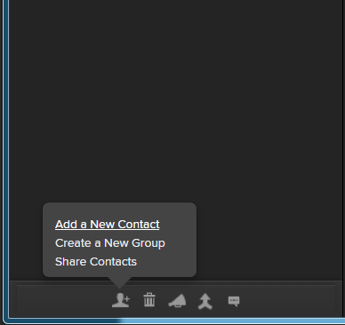
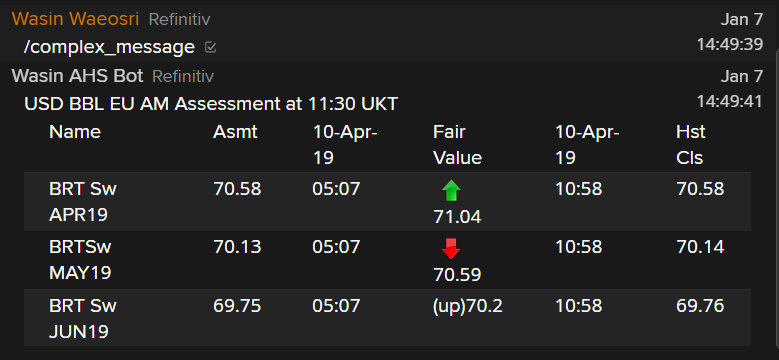

# Messenger Bot API Demo Applications with Python
- Last update: January 2020
- Environment: Windows
- Compiler: Python
- Prerequisite: [Access to Messenger application](#prerequisite)

## Messenger Bot API Introduction

Refinitiv's [Messenger application](https://www.refinitiv.com/en/products/eikon-trading-software/eikon-messenger-securemessaging) is a free to use, compliant and secure messaging platform.  It is a powerful communication tool that provides desktop, mobile, and web access, and allows sharing messages, data, files, screenshots, and emoticons with your contacts.

The [Messenger Bot API](https://developers.refinitiv.com/messenger-api) provides a set of available API calls to build automated workflows or bots for the Messenger application. The Bot API allows your applications to connect with and pass information into Eikon’s Messenger service programmatically or interact with a bot via a WebSocket connection.

## Table of contents
* [Overview](#overview)
* [Prerequisite](#prerequisite)
* [Getting the AppKey value](#appkey)
* [Setting the Messenger application](#setting)
* [Running the REST API demo application](#running-rest)
* [Running the WebSocket API demo application](#running-ws)
* [Running demo applications with debug log](#running-debug)
* [Authors](#author)
* [References](#references)

## <a id="overview"></a>Messenger Bot API Demo overview

This demo project shows how to implement the Messenger BOT API console applications with the REST and WebSocket APIs in [Python](https://www.python.org/) programming language. The applications makes an authentication with [RDP](https://developers.refinitiv.com/refinitiv-data-platform/refinitiv-data-platform-apis) Authentication service, then lets developers interact with Messeger Application/Chatroom on behalf of Bot via the REST and WebSocket APIs. 
- *chatbot_demo_rest.py*: A REST API example that sends chat message to individual and a Chatroom. 
- *chatbot_demo_ws.py*: A REST and WebSocket APIs example that sends and receives chat message with a Chatroom. 
- *rdp_token.py*: A Python module that manages RDP Authentication process for chatbot_demo_rest.py and chatbot_demo_ws.py applications. This module is based on [RDP Python Quickstart Python source code](https://developers.refinitiv.com/refinitiv-data-platform/refinitiv-data-platform-apis/downloads) implemented by Gurpreet Bal.

Note: Please note that the main concept for using Messager Bot REST and WebSocket APIs are the same for all technologies (see [JavaScript example](https://github.com/Refinitiv-API-Samples/Tutorial.MessengerChatBot.JavaScript)). 

## <a id="prerequisite"></a>Prerequisite 
This tutorial source code requires the following dependencies.
1. [Messenger application](https://www.refinitiv.com/en/products/eikon-trading-software/eikon-messenger-securemessaging).
2. [Python](https://www.python.org/) compiler and runtime
3. Python's [requests 2.x](https://pypi.org/project/requests/) library for both REST and WebSocket connections.
4. Python's [websocket-client](https://pypi.org/project/websocket-client/) library (*version 0.49 or greater*) for the WebSocket connection .
4. Messenger Bot API access and license.

Please contact your Refinitiv's representative and Dino Diviacchi (dino.diviacchi@refinitiv.com) to help you to access Messenger application and Bot API. The Refinitiv team will then provision and set up the bot. Once this is done the email user you provided will receive an automated email with how to set up a password for the bot.

*Note:* 
- The Python example has been qualified with Python versions 3.6.5
- Please refer to the [pip installation guide page](https://pip.pypa.io/en/stable/installing/) if your environment does not have the [pip tool](https://pypi.org/project/pip/) installed. 
- If your environment already have a websocket-client library installed, you can use ```pip list``` command to verify a library version, then use ```pip install --upgrade websocket-client``` command to upgrade websocket-client library. 

## <a id="appkey"></a>Getting the AppKey value

Once you have setup your Messenger user, please access the AppKey Generator Tool via Eikon Desktop/Refinitiv Workspace application (go to the Search Bar and type ```APP KEY```, then select the AppKey Generator) or via a <a href="https://amers1.apps.cp.thomsonreuters.com/apps/AppkeyGenerator">web site</a> (Please access with your Eikon account, *not your bot account*). 

 

You can generate your AppKey via the following steps:
1. Enter an App Display Name
2. Select the tick box next to EDP API as the API Type
3. Click ‘Register’ New App button

You will then see a row for your new app with an AppKey item, which is your client_id for the Refinitiv Data Platform (RDP) Authentication. 

## <a id="setting"></a>Setting the Messenger application

Once you have setup your Messenger user and Bot user, you can add the Bot and create a Chatroom for you and your Bot via the following steps

1. Login to your personal Messenger to add the bot to your contacts, using “Add a New Contact” from the menu in the lower left corner.

     

2. Add bot name **bot_agent.mybot@refinitiv.com**.

     

3. Once you have add the bot it will show up under your contacts (on the left side).

     

4. Create a chatroom using "Create a Bilateral chatroom" button from the menu in the lower left corner.

     

5. Add your Bot to a chatroom by dragging it into your newly created chatroom. 

     

## <a id="running-rest"></a>Running the REST API demo application
1. Unzip or download the tutorial project folder into a directory of your choice 
2. Open a command prompt or console.
3. Run ```$>pip install -r rest-requirements.txt``` command in a console to install all the dependencies libraries.
4. Open the *chatBotAPIPythonREST.py** demo application source code with your editor and input the following parameters
    - ```app_key```: Your AppKey
    - ```bot_username```: Your Bot username
    - ```bot_password```: Your Bot password
    - ```recipient_email``` : Your assoicate Messenger email address 
5. OOpen a command prompt and go to folder *src*, then run the demo application with the following command.
    ```
    $>python chatbot_demo_rest.py
    ```
6. The application then authenticates with [RDP](https://developers.refinitiv.com/refinitiv-data-platform) Authentication service and sends a 1-1 message to your assoicate Eikon message email address. 
    ```
    Getting RDP Authentication Token

    Saving Authentication information to file
    Successfully Authenticated
    send 1 to 1 message to <email>
    Messenger BOT API: post a 1 to 1 message to <email> success
    ```
7. Then a demo gets an associate Chatroom and joining to that Chatroom.
    ```
    Get Rooms
    Messenger BOT API: get chatroom  success
    Join Rooms
    Messenger BOT API: join chatroom success
    ```
8. The demo application will send a default ```Hello from Python``` message to a Chatroom on behalf of the Bot API and lets you send your own message before leaving a Chatroom.
    ```
    sending message to {...} Rooms
    Messenger BOT API: post message to chatroom success
    Please input your message: Wendy, I'm home.
    Messenger BOT API: post message to chatroom success
    Leave Rooms
    Messenger BOT API: leave chatroom success
    ```

## <a id="running-ws"></a>Running the WebSocket API demo application
1. Unzip or download the tutorial project folder into a directory of your choice. 
2. Open a command prompt or console.
3. Run ```$>pip install -r ws-requirements.txt``` command in a console to install all the dependencies libraries.
4. Open the *chatBotAPIPythonWS.py** demo application source code with your editor and input the following parameters
    - ```app_key```: Your AppKey
    - ```bot_username```: Your Bot username
    - ```bot_password```: Your Bot password
    - ```recipient_email``` : Your assoicate Messenger email address (For 1 to 1 message)
5. Open a command prompt and go to folder *src*, then run the demo application with the following command.
    ```
    $>python chatbot_demo_ws.py
    ```
6. The demo will perform authentication process, get an assoicate chatroom, then join that chatroom as same as the REST API demo application [above](#running-rest)
7. Then demo connects to the Messenger BOT API WebSocket server. Once the application shows WebSocket ```connected``` event in a console, you can start interact with your bot via a chatroom.
    ```
    Messenger BOT API: join chatroom success
    Connecting to WebSocket wss://api.collab.refinitiv.com/services/nt/api/messenger/v1/stream ...
    WebSocket Connection is established
    Sent:....
    Received:
    {
    "event":"connected",
    "reqId":"943378"
    }
    ```
8. Now we should be able to receive a response from our chatbot. You can test by sending ```hello``` message in to a Chatroom to see an example.
9. The Messenger application supports tabular data, hyperlinks and a full set of emoji in the message. You can type ```/complex_message``` message into a Chatroom to see an example.
     

## <a id="running-debug"></a>Running demo applications with debug log
You can enable the REST and WebSocket application debug log level via ```log_level = logging.WARN``` application source code statement.The supported values are *logging.WARN* and *logging.DEBUG* levels.

The *logging.DEBUG* level shows incoming and outgoing messages between the demo applications and Messenger BOT API REST and WebSocket servers.

## <a id="author"></a>Authors
- Wasin Waeosri (wasin.waeosri@refinitiv.com)
- Dino Diviacchi (dino.diviacchi@refinitiv.com)

## <a id="references"></a>References
For further details, please check out the following resources:
* [Refinitiv Messenger Bot API page](https://developers.refinitiv.com/messenger-api) on the [Refinitiv Developer Community](https://developers.refinitiv.com/) web site.
* [Refinitiv Messenger Bot API: Quick Start](https://developers.refinitiv.com/messenger-api/messenger-bot-api/quick-start). 
* [Refinitiv Messenger Bot API: Documentation page](https://developers.refinitiv.com/messenger-api/messenger-bot-api/docs).
* [Refinitiv Messenger Bot API Demo application - JavaScript](https://github.com/Refinitiv-API-Samples/Tutorial.MessengerChatBot.JavaScript)